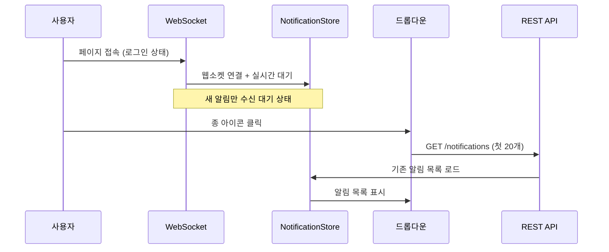
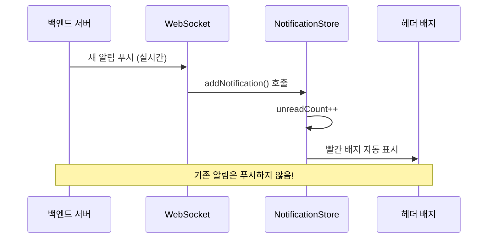
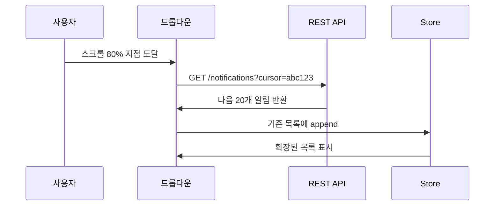
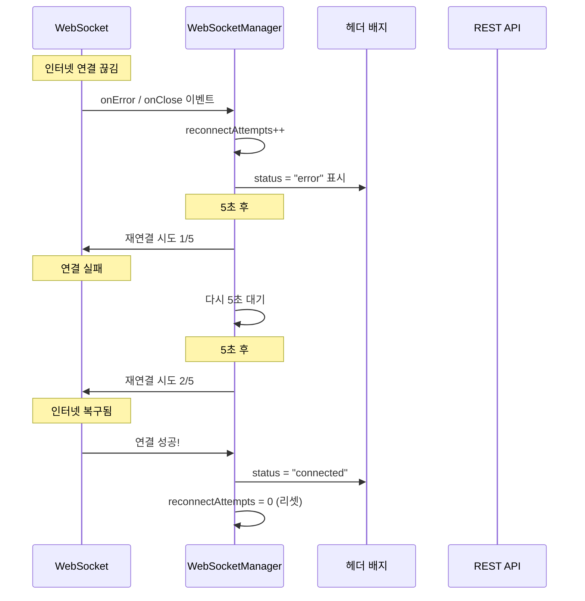
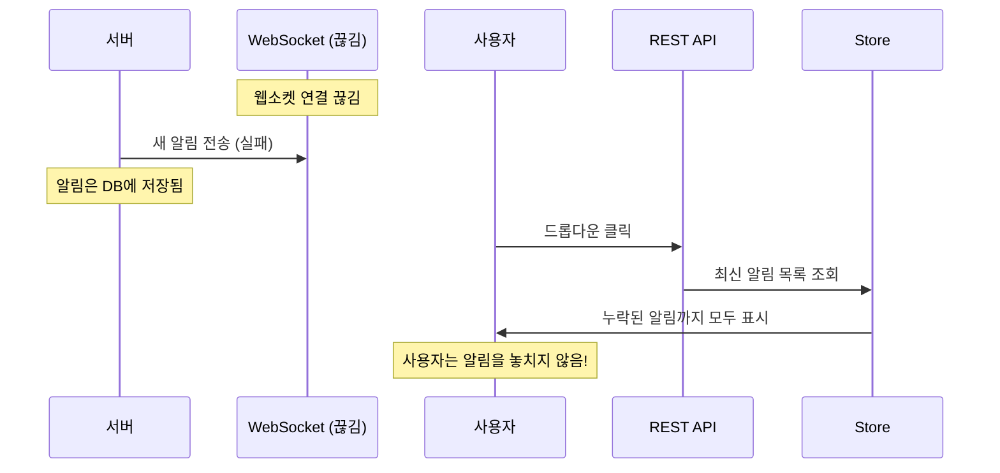
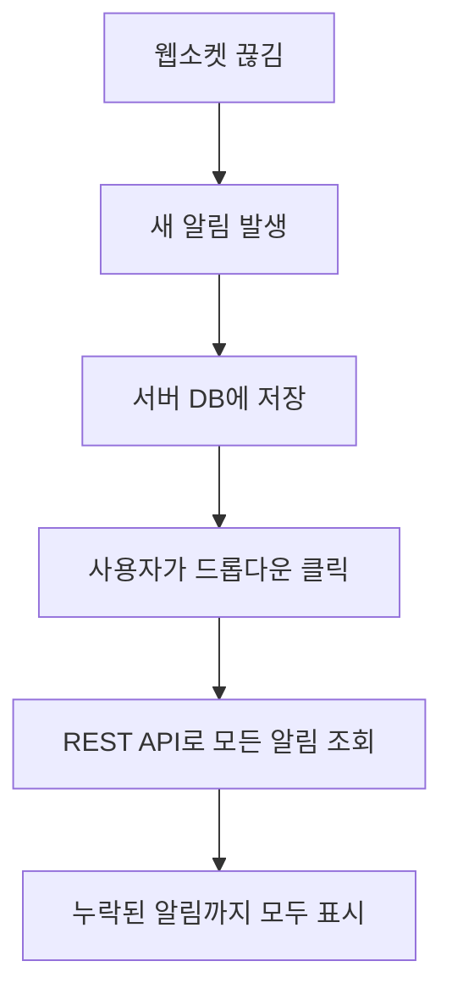

# 🔔 실시간 알림 시스템 구현 문서

## 📋 개요

Haemeok Next.js 프로젝트에 Feature-Sliced Design(FSD) 아키텍처를 기반으로 실시간 알림 시스템을 구현했습니다.

## 🎯 주요 기능

- ✅ 웹소켓 기반 실시간 알림 수신
- ✅ 8가지 알림 타입 지원
- ✅ 커서 기반 무한 스크롤 페이지네이션
- ✅ shadcn Popover를 활용한 드롭다운 UI
- ✅ 종 모양 아이콘의 빨간 배지 표시 (토스트 없음)
- ✅ 읽음/삭제 상태 관리
- ✅ 자동 재연결 및 하트비트

## 🏗️ 아키텍처 구조 (FSD)

### 📁 디렉토리 구조

```
src/
├── shared/                           # 공통 자원
│   ├── config/constants/
│   │   └── notification.ts          # 알림 설정 상수
│   ├── types/index.ts               # 타입 정의
│   └── lib/websocket.ts             # WebSocket 매니저
│
├── entities/                        # 데이터 엔티티
│   └── notification/
│       ├── model/
│       │   ├── store.ts             # Zustand 상태 관리
│       │   ├── api.ts               # REST API 함수
│       │   └── hooks.ts             # React Query 훅
│       └── ui/
│           ├── NotificationIcon.tsx  # 알림 아이콘
│           ├── NotificationBadge.tsx # 빨간 배지
│           └── NotificationItem.tsx  # 개별 알림 아이템
│
├── features/                        # 기능 단위
│   ├── notification-mark-read/      # 읽음 처리
│   ├── notification-delete/         # 삭제 기능
│   └── notification-toast/          # 배지 업데이트 (토스트 비활성화)
│
├── widgets/                         # 복합 위젯
│   ├── NotificationList/            # 알림 목록 위젯
│   │   ├── ui/
│   │   │   ├── NotificationList.tsx # 메인 컴포넌트
│   │   │   ├── LoadingSkeleton.tsx  # 로딩 상태
│   │   │   ├── ErrorState.tsx       # 에러 상태
│   │   │   ├── EmptyState.tsx       # 빈 상태
│   │   │   └── InfiniteScrollTrigger.tsx # 무한스크롤 트리거
│   │   └── model/hooks.ts           # 복합 비즈니스 로직
│   └── NotificationDropdown/        # 헤더 드롭다운
│
└── app/providers/
    └── WebSocketProvider.tsx        # 웹소켓 연결 관리
```

## 📊 데이터 플로우 & 웹소켓 vs REST API 역할 구분

### 🔄 핵심 아키텍처 개념

**웹소켓과 REST API는 서로 다른 역할을 담당합니다:**

#### 1. 📡 **웹소켓**: 실시간 신규 알림만 수신

- 새로운 알림이 생성될 때만 서버에서 푸시
- 배지 업데이트와 실시간 알림 개수 반영용
- 기존 알림 목록은 전송하지 않음

#### 2. 🌐 **REST API**: 기존 알림 목록 조회

- 사용자가 드롭다운을 열 때 기존 알림들을 페이지네이션으로 불러옴
- 무한스크롤로 과거 알림들을 점진적 로드
- 읽음/삭제 등의 상태 변경 작업

### 🔄 완전한 데이터 플로우

#### 시나리오 1: 최초 페이지 접속



#### 시나리오 2: 실시간 새 알림 수신



#### 시나리오 3: 무한스크롤로 과거 알림 로드



## 🔧 주요 구성 요소

### 1. 알림 타입 정의

```typescript
// src/shared/types/index.ts
export type NotificationType =
  | "RECIPE_LIKE" // 레시피 좋아요
  | "RECIPE_COMMENT" // 레시피 댓글
  | "COMMENT_REPLY" // 댓글 답글
  | "RECIPE_FEATURED" // 레시피 추천
  | "FOLLOW" // 팔로우
  | "SYSTEM" // 시스템 알림
  | "ANNOUNCEMENT" // 공지사항
  | "PROMOTION"; // 프로모션

export type Notification = {
  id: string;
  type: NotificationType;
  title: string;
  message: string;
  isRead: boolean;
  createdAt: string;
  data?: {
    url?: string; // 이동할 URL
    userId?: string; // 관련 사용자
    recipeId?: string; // 관련 레시피
    commentId?: string; // 관련 댓글
  };
};
```

### 2. WebSocket 관리

```typescript
// src/shared/lib/websocket.ts
export class WebSocketManager {
  // 자동 재연결, 하트비트, 에러 처리
  // 연결 상태: disconnected | connecting | connected | error
}
```

### 3. 상태 관리 (Zustand)

```typescript
// src/entities/notification/model/store.ts
export const useNotificationStore = create<NotificationStore>()({
  notifications: [],
  unreadCount: 0,
  addNotification, // 새 알림 추가
  markAsRead, // 읽음 처리
  markAllAsRead, // 모두 읽음
  deleteNotification, // 삭제
  // ...
});
```

### 4. 무한 스크롤 API

```typescript
// src/entities/notification/model/hooks.ts
export const useInfiniteNotifications = () => {
  return useInfiniteQuery({
    queryKey: ["notifications", "infinite"],
    queryFn: ({ pageParam }) => fetchNotifications({ cursor: pageParam }),
    // 커서 기반 페이지네이션
  });
};
```

## 🎨 UI 컴포넌트

### 1. NotificationDropdown (shadcn Popover 사용)

```typescript
// src/widgets/NotificationDropdown/ui/NotificationDropdown.tsx
<Popover open={isOpen} onOpenChange={setIsOpen}>
  <PopoverTrigger asChild>
    <button>
      <Bell size={24} />
      {unreadCount > 0 && <NotificationBadge count={unreadCount} />}
    </button>
  </PopoverTrigger>
  <PopoverContent>
    <NotificationList onNotificationClick={handleClose} />
  </PopoverContent>
</Popover>
```

### 2. NotificationList (단일 책임 분리)

- `LoadingSkeleton`: 로딩 상태만 담당
- `ErrorState`: 에러 상태만 담당
- `EmptyState`: 빈 상태만 담당
- `InfiniteScrollTrigger`: 무한스크롤 트리거만 담당

## 🔄 상태 변화 시나리오

### 시나리오 1: 새 알림 수신

1. 서버에서 웹소켓으로 알림 전송
2. `WebSocketProvider`가 `notification-received` 이벤트 발생
3. `NotificationStore`가 이벤트를 감지하고 `addNotification` 실행
4. `unreadCount` 증가
5. 헤더의 종 아이콘에 빨간 배지 자동 표시

### 시나리오 2: 알림 확인

1. 사용자가 종 아이콘 클릭
2. shadcn Popover가 드롭다운 열기
3. `useInfiniteNotifications` 훅이 API 호출
4. 알림 목록 렌더링 (무한스크롤 지원)

### 시나리오 3: 읽음 처리

1. 사용자가 특정 알림 클릭
2. `useNotificationMarkRead` 훅이 API 호출
3. 옵티미스틱 업데이트로 즉시 UI 반영
4. `unreadCount` 감소
5. 드롭다운 자동 닫기

## ⚙️ 설정 및 상수

### 알림 관련 설정

```typescript
// src/shared/config/constants/notification.ts
export const NOTIFICATION_CONFIG = {
  MAX_NOTIFICATIONS: 100, // 최대 보관 알림 수
  PAGINATION_LIMIT: 20, // 페이지당 알림 수
  TOAST_DURATION: 5000, // 토스트 지속시간 (비활성화됨)
  INFINITE_SCROLL_THRESHOLD: 0.8, // 무한스크롤 트리거 (80%)
  WEBSOCKET: {
    RECONNECT_INTERVAL: 3000, // 재연결 간격
    MAX_RECONNECT_ATTEMPTS: 5, // 최대 재연결 시도
    HEARTBEAT_INTERVAL: 30000, // 하트비트 간격
  },
};
```

## 🚀 성능 최적화

### 1. React Query 캐싱

- 알림 목록 서버 상태 캐싱
- 백그라운드 자동 갱신
- 옵티미스틱 업데이트

### 2. 무한 스크롤

- 초기 로드: 20개 알림만
- 스크롤 80% 지점에서 추가 로드
- 커서 기반 페이지네이션으로 중복 방지

### 3. 메모리 관리

- 최대 100개 알림까지만 보관
- 오래된 알림 자동 정리

## 🔧 예외 상황 및 자동 복구 시스템

### 📡 WebSocket 연결 관리 상세

#### 1. 자동 재연결 메커니즘

```typescript
// src/shared/lib/websocket.ts의 실제 구현
class WebSocketManager {
  private reconnectAttempts = 0;
  private reconnectTimer: NodeJS.Timeout | null = null;

  private handleConnectionError(): void {
    this.onStatusChange("error");
    this.ws = null;

    // 최대 5회까지 재연결 시도
    if (this.reconnectAttempts < 5) {
      this.scheduleReconnect();
    }
  }

  private scheduleReconnect(): void {
    this.reconnectAttempts++;
    this.reconnectTimer = setTimeout(() => {
      console.log(`재연결 시도 ${this.reconnectAttempts}/5`);
      this.connect();
    }, 5000); // 5초 후 재연결
  }
}
```

#### 2. 하트비트로 연결 상태 모니터링

```typescript
private startHeartbeat(): void {
  this.heartbeatTimer = setInterval(() => {
    this.send({ type: "HEARTBEAT" });
  }, 30000); // 30초마다 하트비트
}
```

### 🌐 예기치 않은 상황별 대응

#### 시나리오 A: 인터넷 연결 끊김



#### 시나리오 B: 웹소켓 연결 끊김 중 새 알림 발생



#### 시나리오 C: 페이지 비활성화 후 재활성화

```typescript
// src/app/providers/WebSocketProvider.tsx의 실제 구현
useEffect(() => {
  const handleVisibilityChange = () => {
    if (
      document.visibilityState === "visible" &&
      user &&
      wsManagerRef.current
    ) {
      // 페이지가 다시 활성화되면 연결 상태 확인
      if (wsManagerRef.current.getConnectionStatus() === "disconnected") {
        wsManagerRef.current.connect(); // 자동 재연결
      }
    }
  };

  document.addEventListener("visibilitychange", handleVisibilityChange);
  return () =>
    document.removeEventListener("visibilitychange", handleVisibilityChange);
}, [user]);
```

### 🔄 데이터 동기화 전략

#### 1. 웹소켓 끊김 시 데이터 무결성 보장

- **웹소켓**: 실시간 배지 업데이트만 담당
- **REST API**: 항상 최신 정보 제공 (단일 진실 공급원)
- **전략**: 드롭다운을 열 때마다 API로 최신 상태 동기화

#### 2. 옵티미스틱 업데이트 + 서버 검증

```typescript
// 읽음 처리 시
const markAsRead = (id: string) => {
  // 1. 즉시 UI 업데이트 (옵티미스틱)
  store.markAsRead(id);

  // 2. 서버에 전송
  api.markAsRead(id).catch(() => {
    // 3. 실패 시 롤백
    store.markAsUnread(id);
    showError("읽음 처리에 실패했습니다.");
  });
};
```

### ⚡ 성능 최적화 재연결 로직

#### 1. 지수 백오프 (Exponential Backoff)

현재는 고정 5초이지만, 향후 개선 시:

```typescript
const getReconnectDelay = (attempt: number) => {
  return Math.min(1000 * Math.pow(2, attempt), 30000); // 1초→2초→4초→8초→16초→30초
};
```

#### 2. 연결 품질 모니터링

```typescript
// 하트비트 응답 시간으로 연결 품질 측정
private monitorConnectionQuality() {
  const startTime = Date.now();
  this.send({ type: "HEARTBEAT" });

  // 응답이 3초 이상 걸리면 연결 불안정으로 판단
  setTimeout(() => {
    if (!this.receivedHeartbeatResponse) {
      this.handleSlowConnection();
    }
  }, 3000);
}
```

## 🔒 에러 처리

### 1. WebSocket 연결 실패

- ✅ 자동 재연결 (최대 5회, 5초 간격)
- ✅ 연결 상태를 UI에 표시
- ✅ 페이지 재활성화 시 자동 재연결
- ✅ 하트비트로 연결 품질 모니터링 (30초 간격)

### 2. API 호출 실패

- ✅ React Query의 자동 재시도
- ✅ 에러 상태 UI 표시
- ✅ "다시 시도" 버튼 제공
- ✅ 옵티미스틱 업데이트 롤백

## 📱 접근성 (a11y)

### shadcn Popover 사용으로 확보된 기능들

- ✅ 키보드 네비게이션 (Tab, Enter, Esc)
- ✅ ARIA 속성 자동 설정
- ✅ 포커스 관리
- ✅ 스크린 리더 지원

## 🧪 테스트 고려사항

### 단위 테스트 대상

- [ ] `WebSocketManager` 클래스
- [ ] `useNotificationStore` 상태 변화
- [ ] 개별 UI 컴포넌트 렌더링

### 통합 테스트 대상

- [ ] 웹소켓 연결 → 스토어 업데이트 → UI 반영
- [ ] 무한 스크롤 동작
- [ ] 읽음/삭제 기능 플로우

## 🔧 향후 개선 방향

### 1. 기능 확장

- [ ] 알림 카테고리별 필터링
- [ ] 알림 음소거 설정
- [ ] 중요도별 알림 우선순위

### 2. 성능 개선

- [ ] 가상화 스크롤 (react-window)
- [ ] Service Worker를 통한 백그라운드 알림

### 3. 사용자 경험

- [ ] 알림 미리보기
- [ ] 알림 스누즈 기능
- [ ] 개인화된 알림 설정

## ❓ 자주 묻는 질문 (FAQ)

### Q1: 웹소켓을 연결하면 모든 기존 알림이 자동으로 오는 것 아닌가요?

**A**: 아닙니다! 웹소켓은 **신규 알림만** 실시간으로 푸시합니다.

- **웹소켓 역할**: 새로 생성된 알림 1개씩 실시간 전송
- **REST API 역할**: 기존 알림 목록을 페이지네이션으로 조회
- **이유**: 대용량 데이터를 웹소켓으로 전송하면 성능 저하

### Q2: 그럼 왜 드롭다운을 열 때 API를 따로 호출하나요?

**A**: 기존 알림 목록을 불러오기 위해서입니다.

```
📱 사용자 시점:
1. 페이지 접속 → 웹소켓 연결 (실시간 대기 상태)
2. 종 아이콘 클릭 → REST API로 기존 알림 20개 조회
3. 새 알림 도착 → 웹소켓으로 배지 업데이트
4. 스크롤 → REST API로 과거 알림 추가 로드
```

### Q3: 인터넷이 끊기면 알림을 놓치나요?

**A**: 놓치지 않습니다! 복구 메커니즘이 있습니다.

1. **재연결**: 5초마다 최대 5회 자동 재연결 시도
2. **동기화**: 드롭다운 열 때 API로 최신 상태 조회
3. **복구**: 페이지 재활성화 시 연결 상태 확인 후 재연결

### Q4: 웹소켓이 끊긴 동안 발생한 알림은 어떻게 처리되나요?

**A**: 서버에 저장되어 있다가 다음에 드롭다운을 열 때 모두 표시됩니다.



### Q5: 배지 숫자와 실제 알림 목록이 안 맞을 수 있나요?

**A**: 거의 없습니다. 동기화 전략이 있습니다.

- **웹소켓**: 배지 개수만 업데이트 (빠른 반응)
- **REST API**: 실제 알림 목록 + 정확한 개수 (정확성)
- **동기화**: 드롭다운 열 때 API 데이터로 배지도 업데이트

### Q6: 성능에 문제없나요?

**A**: 최적화되어 있습니다.

- **무한스크롤**: 초기 20개만 로드, 필요시 추가 로드
- **React Query**: 캐싱으로 불필요한 API 호출 방지
- **메모리 관리**: 최대 100개 알림까지만 보관
- **하트비트**: 30초마다만 연결 확인

### Q7: 다른 탭에서도 알림이 동기화되나요?

**A**: 현재는 탭별로 독립적이지만, 향후 개선 가능합니다.

**현재**: 각 탭이 독립적인 웹소켓 연결
**향후**: SharedWorker나 BroadcastChannel로 탭 간 동기화 가능

---

## 📝 리뷰 체크리스트

### 아키텍처

- [x] FSD 레이어 의존성 규칙 준수
- [x] 단일 책임 원칙 적용
- [x] 적절한 관심사 분리

### 코드 품질

- [x] TypeScript 타입 안정성
- [x] 일관된 네이밍 컨벤션
- [x] 적절한 추상화 레벨

### 사용자 경험

- [x] 직관적인 UI/UX
- [x] 빠른 응답성
- [x] 접근성 고려

### 성능

- [x] 효율적인 상태 관리
- [x] 최적화된 렌더링
- [x] 메모리 누수 방지
