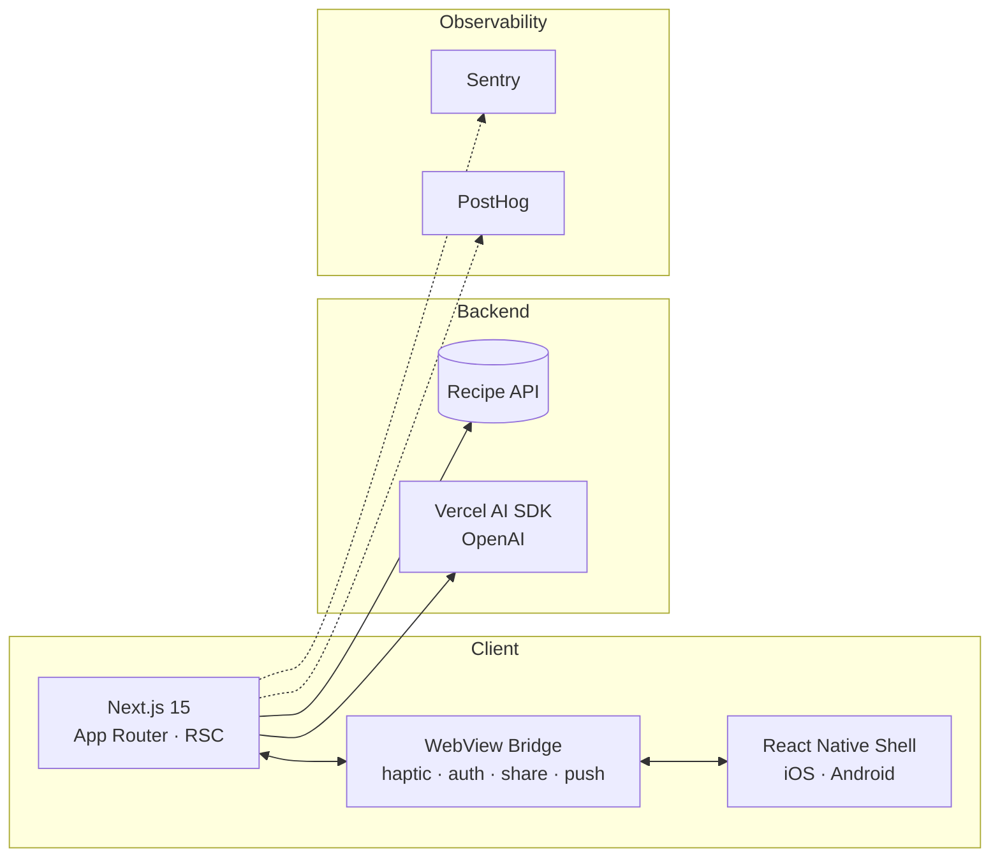

# 레시피오 · Recipio

**유튜브 레시피, 곧장 내 냉장고로.**
AI로 레시피를 생성하고, 보유한 재료로 탐색하고, 캘린더에 기록하는 요리 플랫폼.

 

[**Live Demo**](https://www.recipio.kr/) · [**App Store**](https://www.recipio.kr/) · [**Google Play**](https://www.recipio.kr/)

 

---

## Features

<table>
  <tr>
    <td width="33%" valign="top">
      <h3>AI 레시피 생성</h3>
      
영양 · 재료 · 파인다이닝 · 가성비 <b>4가지 모드</b>로 LLM 호출. Vercel AI SDK 기반 스트리밍.

    </td>
    <td width="33%" valign="top">
      <h3>유튜브 레시피 임포트</h3>
      
유튜브 URL 한 줄로 레시피 카드 자동 생성. 트렌딩 큐레이션과 쿼터 관리 내장.

    </td>
    <td width="33%" valign="top">
      <h3>냉장고 재료 관리</h3>
      
보유 재료를 등록하고 그 안에서만 가능한 레시피를 탐색. 유통기한 추적.

    </td>
  </tr>
  <tr>
    <td width="33%" valign="top">
      <h3>레시피북 & 캘린더</h3>
      
레시피를 컬렉션으로 묶고, 캘린더에 요리한 날을 기록. 타임라인 회고.

    </td>
    <td width="33%" valign="top">
      <h3>검색 & 필터</h3>
      
재료 · 정렬 · 태그 · 요리 타입 4축 복합 필터. 큐레이션 기반 디스커버리.

    </td>
    <td width="33%" valign="top">
      <h3>소셜 로그인</h3>
      
Google · Apple · Kakao · Naver 4종 OAuth. WebView에서 네이티브 인증 브리지.

    </td>
  </tr>
</table>

 

## Architecture

Next.js 15 웹과 React Native WebView 앱(iOS/Android)이 **같은 코드베이스**를 공유합니다.
네이티브 기능(햅틱, 푸시, 공유, 인증)은 WebView Bridge로 노출됩니다.

**Feature-Sliced Design** 4단계 구조 (`shared → entities → features → widgets → app`).
역방향 import 금지, 동일 레이어 cross-import 금지.

entities <b>7</b> · features <b>48</b> · widgets <b>45</b> · routes <b>20+</b>

 

## Built with

  
  

| Layer | Tech |
|---|---|
| **Framework** | Next.js 15.3 (App Router · Turbopack) · React 19 |
| **Language** | TypeScript 5 (strict) |
| **Styling** | Tailwind CSS 4 · Radix UI |
| **Animation** | Motion 12 · GSAP 3 |
| **State** | TanStack Query 5 · Zustand 5 |
| **Forms** | React Hook Form 7 · Zod 4 |
| **AI** | Vercel AI SDK 5 · OpenAI |
| **Observability** | Sentry · PostHog · Lighthouse CI |
| **Compiler** | React Compiler (experimental) |

 

---

  Made with 🍳 by <a href="https://github.com/1119wj">@1119wj</a>

