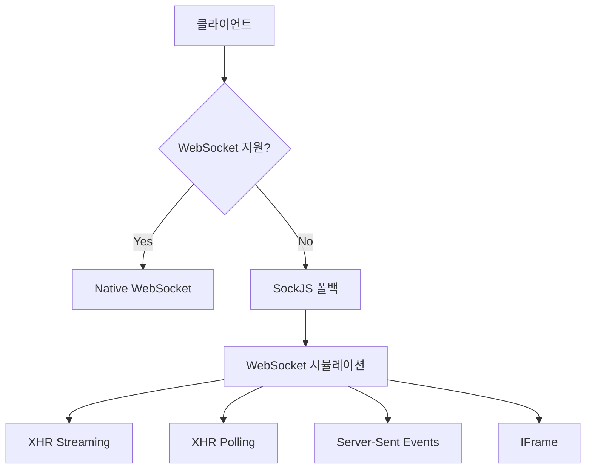
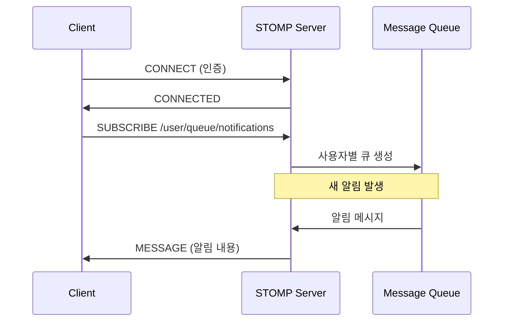

# 🔌 SockJS + STOMP 완전 가이드

## 📋 개요

SockJS + STOMP는 Spring Boot에서 표준으로 사용하는 실시간 통신 스택입니다. 안정적이고 확장 가능한 WebSocket 대안을 제공합니다.

## 🏗️ SockJS + STOMP 아키텍처

### 1. 📡 **SockJS (Simple JavaScript WebSocket-like API)**

#### 핵심 개념



#### 전송 방식 우선순위

1. **WebSocket** (가장 빠름)
2. **XHR Streaming** (HTTP/1.1 지속 연결)
3. **Server-Sent Events** (SSE)
4. **IFrame based transports**
5. **XHR Polling** (최후 수단)

#### SockJS의 장점

```typescript
// 자동 폴백 - 개발자가 신경쓸 필요 없음
const socket = new SockJS("/ws/notifications");
// SockJS가 자동으로 최적의 전송 방식 선택

// 프록시/방화벽 우회
// 일반 HTTP 요청으로 위장 가능
```

### 2. 🚀 **STOMP (Simple Text Oriented Messaging Protocol)**

#### 메시지 브로커 패턴



#### STOMP 프레임 구조

```
COMMAND
header1:value1
header2:value2

Body^@
```

실제 예시:

```
SUBSCRIBE
id:sub-0
destination:/user/queue/notifications

^@
```

## 🔄 CDN vs 번들링 비교

### 📦 **번들링 방식 (npm install)**

#### 장점 ✅

- **타입 안정성**: TypeScript 정의 파일 포함
- **번들 최적화**: Tree shaking, 코드 분할 가능
- **오프라인 동작**: 네트워크 없이도 작동
- **버전 고정**: package.json으로 정확한 버전 관리

#### 단점 ❌

- **번들 크기 증가**: ~100KB 추가
- **초기 로딩 느림**: 모든 코드를 처음에 로드
- **메모리 사용량 증가**: 사용하지 않아도 메모리 점유

```typescript
// 번들링 방식
npm install sockjs-client @stomp/stompjs
npm install -D @types/sockjs-client

import SockJS from 'sockjs-client';
import { Client } from '@stomp/stompjs';
```

### 🌐 **CDN 방식 (현재 구현)**

#### 장점 ✅

- **작은 초기 번들**: 필요할 때만 로드
- **빠른 초기 로딩**: 메인 앱 번들 크기 감소
- **브라우저 캐싱**: CDN 캐시 활용
- **조건부 로딩**: WebSocket 사용할 때만 로드

#### 단점 ❌

- **네트워크 의존**: CDN 장애 시 동작 불가
- **타입 부족**: any 타입 사용 필요
- **로딩 지연**: 동적 로딩으로 인한 약간의 지연

```typescript
// CDN 방식 (현재 구현)
const script = document.createElement("script");
script.src = "https://cdn.jsdelivr.net/npm/sockjs-client@1/dist/sockjs.min.js";
// any 타입 사용 불가피
const socket = new (window as any).SockJS("/ws/notifications");
```

## ⚡ 성능 비교

### 번들 크기 영향

```
📦 번들링 방식:
├── sockjs-client: ~45KB gzipped
├── @stomp/stompjs: ~25KB gzipped
└── 총 증가: ~70KB

🌐 CDN 방식:
├── 초기 번들: 0KB 증가
├── 런타임 로딩: ~70KB (필요시에만)
└── 총 절약: 70KB (사용하지 않는 사용자에게)
```

### 로딩 시간 비교

```typescript
// 시나리오 1: 로그인하지 않은 사용자 (50% 가정)
번들링: 70KB 항상 로드 (불필요)
CDN: 0KB 로드 (70KB 절약! ✨)

// 시나리오 2: 로그인한 사용자 (50% 가정)
번들링: 초기 로딩에 포함 (즉시 사용 가능)
CDN: 300-500ms 동적 로딩 후 사용
```

## 🔧 타입 안정성 문제와 해결책

### 현재 any 타입 사용 이유

```typescript
// 현재 구현 - any 타입 불가피
private socket: any = null;
private stompClient: any = null;

// 이유: CDN으로 로드하면 타입 정의를 가져올 수 없음
```

### 🛠️ 타입 개선 방안들

#### 방안 1: 최소한의 타입 정의 추가

```typescript
// src/shared/lib/sockjs-types.ts
interface SockJSSocket {
  readyState: number;
  close(): void;
  send(data: string): void;
}

interface StompClient {
  connected: boolean;
  connect(headers: any, onConnect: Function, onError: Function): void;
  disconnect(callback?: Function): void;
  subscribe(destination: string, callback: Function): { unsubscribe(): void };
  send(destination: string, headers: any, body: string): void;
  debug?: Function | null;
}

// 사용
private socket: SockJSSocket | null = null;
private stompClient: StompClient | null = null;
```

#### 방안 2: 하이브리드 접근 (권장)

```typescript
// 개발 환경: 번들링 (타입 안정성)
// 프로덕션: CDN (성능 최적화)

if (process.env.NODE_ENV === "development") {
  // npm 패키지 사용 - 타입 완벽 지원
  const SockJS = await import("sockjs-client");
  const { Client } = await import("@stomp/stompjs");
} else {
  // CDN 사용 - 성능 최적화
  await this.loadLibraries();
  const SockJS = (window as any).SockJS;
}
```

#### 방안 3: 완전 번들링 마이그레이션

```bash
# 설치
npm install sockjs-client @stomp/stompjs
npm install -D @types/sockjs-client

# 이점: 완전한 타입 안정성
# 단점: 번들 크기 증가
```

## 📊 권장사항 매트릭스

### 프로젝트 규모별 권장사항

| 프로젝트 규모              | 사용자 패턴      | 권장 방식  | 이유             |
| -------------------------- | ---------------- | ---------- | ---------------- |
| **소규모** (< 1만 사용자)  | 대부분 로그인    | 번들링     | 개발 편의성 우선 |
| **중규모** (1-10만 사용자) | 혼재             | 하이브리드 | 최적의 밸런스    |
| **대규모** (10만+ 사용자)  | 많은 익명 사용자 | CDN        | 성능 최적화 우선 |

### 기술적 우선순위별 권장사항

```typescript
// 🎯 타입 안정성 우선 (TypeScript 프로젝트)
번들링 방식 권장
+ 완벽한 타입 추론
+ IDE 자동완성 지원
+ 컴파일 타임 에러 검출

// ⚡ 성능 우선 (큰 사용자 기반)
CDN 방식 권장
+ 초기 로딩 속도 향상
+ 조건부 로딩으로 불필요한 코드 제거
+ CDN 캐싱 효과

// 🔄 유지보수성 우선 (장기 프로젝트)
하이브리드 방식 권장
+ 개발: 번들링 (디버깅 편의)
+ 프로덕션: CDN (성능)
+ 환경별 최적화
```

## 🔮 미래 개선 방향

### 1. 점진적 타입 추가

```typescript
// Phase 1: 기본 인터페이스 정의
interface SockJSBasic {
  close(): void;
  readyState: number;
}

// Phase 2: 상세 타입 추가
interface SockJSComplete extends SockJSBasic {
  url: string;
  protocol: string;
  onopen: (event: Event) => void;
  onclose: (event: CloseEvent) => void;
  // ...
}

// Phase 3: 제네릭 지원
interface StompClient<T = any> {
  subscribe<U = T>(
    destination: string,
    callback: (message: U) => void
  ): Subscription;
}
```

### 2. 성능 모니터링 추가

```typescript
class SockJSWebSocketManager {
  private metrics = {
    connectionTime: 0,
    loadTime: 0,
    transportType: "",
  };

  private async connect() {
    const startTime = performance.now();
    // ... 연결 로직
    this.metrics.connectionTime = performance.now() - startTime;
  }
}
```

### 3. 스마트 로딩 전략

```typescript
// 사용자 패턴 기반 예측 로딩
if (isLikelyToUseWebSocket(userBehavior)) {
  // 미리 라이브러리 프리로드
  this.preloadLibraries();
}
```

## 💡 결론 및 현재 구현 평가

### 🎯 현재 CDN 방식 선택이 적절한 이유

1. **실용적 접근**:
   - 알림 기능은 모든 사용자가 사용하지 않음
   - 70KB 절약 효과가 상당함

2. **개발 효율성**:
   - 빠른 프로토타이핑 가능
   - 라이브러리 버전 관리 부담 감소

3. **확장성**:
   - 필요시 언제든 번들링으로 전환 가능
   - 하이브리드 방식으로 점진적 개선 가능

### 🔧 단기 개선안

```typescript
// 1. 기본 타입 정의 추가 (1시간)
interface BasicSockJS {
  /* ... */
}
interface BasicStomp {
  /* ... */
}

// 2. 에러 핸들링 강화 (30분)
if (!window.SockJS) {
  throw new Error("SockJS 로딩 실패 - 네트워크를 확인하세요");
}

// 3. 로딩 상태 UI 추가 (1시간)
this.onStatusChange("loading-libraries");
```

### 🚀 장기 로드맵 (우선순위별)

1. **P0**: 기본 타입 정의 추가 (안정성)
2. **P1**: 하이브리드 로딩 구현 (성능 + 개발 편의성)
3. **P2**: 성능 메트릭 추가 (모니터링)
4. **P3**: 완전 번들링 마이그레이션 옵션 (장기 안정성)

현재 CDN 방식은 **프로젝트 초기 단계에서 성능과 개발 속도의 최적 밸런스**를 제공하는 현명한 선택입니다! 🎉
